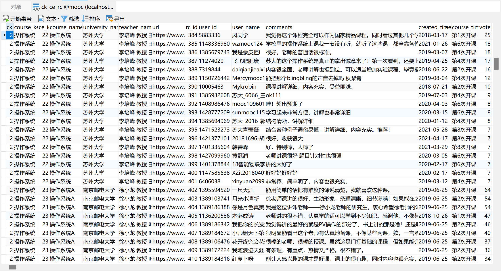
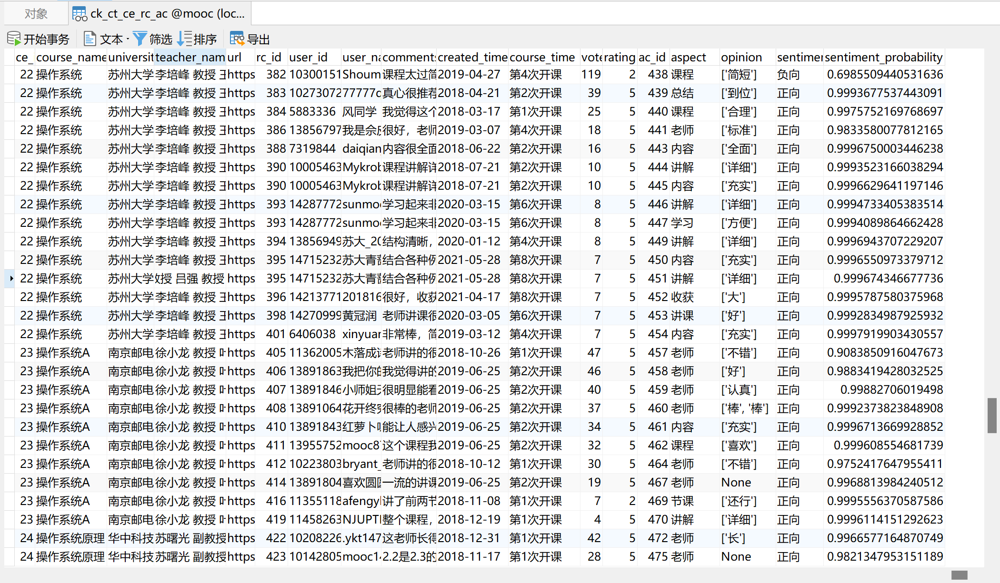
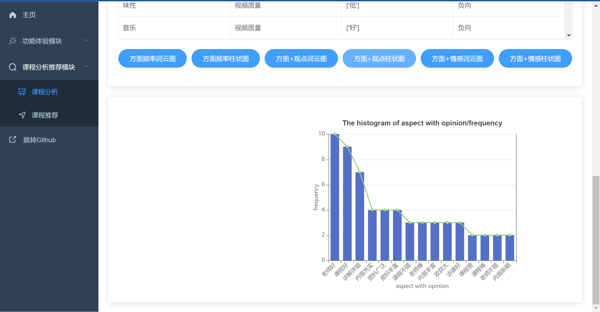
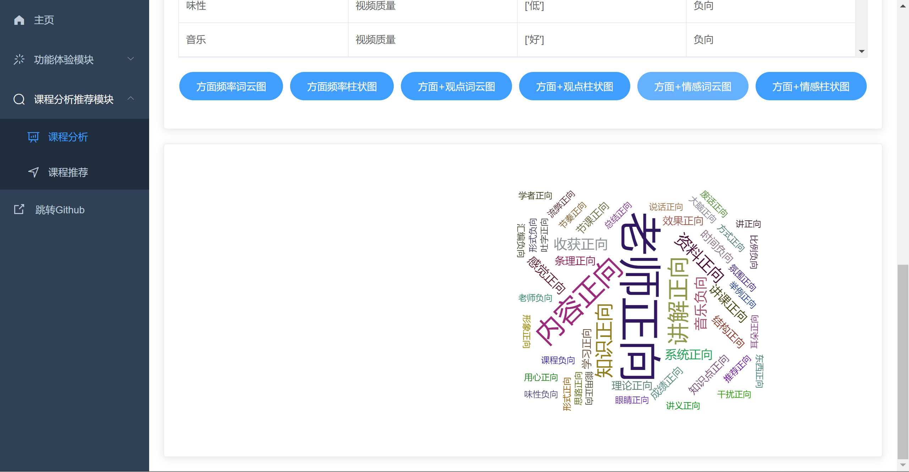

# 项目名称：慕课评论方面级情感分析与推荐系统
# PROJECT: MOOC-ABSA-REC-SYS, MARS

演示视频（Demo Video）：

[](https://youtu.be/bfZrwh14F68)

# 一. 项目简介

## 1.1 概述

慕课评论方面级情感分析与推荐系统（MARS，MOOC-ABSA-REC-SYS）支持中国大学慕课网评论数据爬取、评论文本方面级情感分析、分析结果的可视化展示、基于评论文本方面级情感分析结果和其它评论数据的个性化推荐。

## 1.2 详情

慕课评论方面级情感分析与推荐系统（MARS，MOOC-ABSA-REC-SYS）通过使用一种融合评论方面级情感分析的推荐算法，以求解决现有慕课平台课程信息过载、学习者选课困难、授课者忽视反馈的问题。我们首先将以上问题归结于授课反馈难以被充分挖掘和量化体现的问题，面对这个问题，我们通过阅读大量方面级情感分析论文，讨论认为使用ACOS（Aspect-Class-Opinon-Sentiment）方面级情感分析方法能够相对彻底地实现评论挖掘。但此时我们又遇到了原模型技术门槛高难以使用、作为训练集的MOOC评论数据爬取数量受限、数据标注耗费大量时间精力且准确性难以保证的问题，面对新的挑战，我们决定使用提供训练参数、模型先进优异且代码文档清晰的PaddleNLP的通用信息抽取模型UIE（Universal Information Extraction）和通用文本分类模型UTC（Universal Text Classfication）集成新的ACOS模型作为预训练模型UACOS（Universal ACOS），其中UIE用于ACOS的AOS（Aspect-Opinon-Sentiment）分析，即对评论抽取AOS元组；UTC用于ACOS的C（Class）分析，即对A（Aspect）分类。我们再借用迁移学习的思想，通过使用我们自行爬取和标注的MOOC评论数据作为训练集，在具有通用知识的UACOS模型上对两个子模型进行领域微调，得到最终模型MACOS（MOOC-ACOS）。在集成MACOS模型后，系统通过将海量课程评论进行情感分析和可视化展示，可以为学习者提供可解释的个性化推荐以协助优化选课体验、促进提升学习效果，并为授课者提供可追溯的方面级分析以协助调整授课方式、促进提高授课质量。在使用“慕课评论方面级情感分析与推荐系统”后，学习者可以通过选择目标课程和关注方面快速定位适合自己的课程候选，授课者可以通过查看所授课程的方面级情感分析结果调整授课方式以满足学习者需求。

---

## 1.1 Overview:

The MOOC-ABSA-REC-SYS (MARS), a MOOC Review Aspect-Based Sentiment Analysis and Recommendation System, supports scraping comment data from the Chinese MOOC platform (icourse163.org), performing aspect-based sentiment analysis on the review texts, visualizing the analysis results, and providing personalized recommendations based on the outcomes of this analysis and other review data.

## 1.2 Details:

The MOOC-ABSA-REC-SYS (MARS) aims to address prevalent issues in existing MOOC platforms, such as course information overload, difficulties learners face in course selection, and instructors' potential neglect of feedback. It does so by employing a novel recommendation algorithm that integrates aspect-based sentiment analysis of reviews.

We attribute these core issues to the challenge of insufficiently mining and quantitatively representing learner feedback. To tackle this, after extensive research into aspect-based sentiment analysis (ABSA) literature, we identified the ACOS (Aspect-Class-Opinion-Sentiment) method as a promising approach for thorough comment analysis. However, its implementation presented new challenges: the high technical barrier of the original model, limited availability of scraped MOOC comment data for training sets, and the significant time, effort, and accuracy concerns associated with manual data annotation.

To overcome these hurdles, we developed a new pre-trained model named UACOS (Universal ACOS). This model integrates the state-of-the-art Universal Information Extraction (UIE) and Universal Text Classification (UTC) models from PaddleNLP, renowned for their provided training parameters, excellent performance, and clear documentation. Within UACOS, the UIE component handles the AOS (Aspect-Opinion-Sentiment) analysis, extracting AOS tuples from comments. The UTC component performs the C (Class) analysis, classifying the identified aspects.

Leveraging transfer learning, we then fine-tuned the two sub-models of UACOS on a domain-specific training set comprised of our self-scraped and manually annotated MOOC comments. This process yielded our final domain-adapted model, MACOS (MOOC-ACOS).

By integrating the MACOS model, the system processes vast amounts of course reviews for sentiment analysis and visualization. This capability enables two primary functions:
1.  For learners, it provides interpretable, personalized recommendations to optimize course selection and enhance learning outcomes.
2.  For instructors, it offers traceable, aspect-level analysis to assist in refining teaching methods and improving course quality.

Consequently, using the "MOOC Review Aspect-Based Sentiment Analysis and Recommendation System," learners can quickly identify suitable course candidates by specifying target courses and aspects of interest. Instructors can adjust their teaching approaches based on the visualized aspect-level sentiment analysis results for their courses, better aligning with learner needs.

# 二. 项目目录结构   

项目采用前后端分离式架构部署，分为frontend和backend两个文件夹

* backend文件夹为后端接口服务模块，demo.py为模型预测演示程序，main.py为后端接口服务主程序，utils.py定义一些工具函数。
* frontend文件夹为情感分析与推荐系统前端界面模块，基于 vue-admin-template进行开发。 核心关注src/router/index.js和src/views/两大模块，router中定义了界面路由即侧边栏选项框及映射关系，views文件夹下为搭建的新Web界面，包含欢迎页、单文本情感分析界面和批量文本情感分析界面。

# 三. 项目环境配置
## 3.1 后端服务环境配置

首先需要下载安装Python包管理器Anaconda：https://mirrors.tuna.tsinghua.edu.cn/anaconda/archive/
访问镜像下载网站，根据自己电脑系统（win64或Linux等）选择合适的版本，建议选择较新的版本。

配置清华源镜像加速

```bash
conda config --add channels https://mirrors.tuna.tsinghua.edu.cn/anaconda/pkgs/free/
conda config --add channels https://mirrors.tuna.tsinghua.edu.cn/anaconda/pkgs/main/
conda config --set show_channel_urls yes
```

安装paddlepaddle

```bash
conda install paddlepaddle==2.6.0 --channel https://mirrors.tuna.tsinghua.edu.cn/anaconda/cloud/Paddle/
```

创建新虚拟环境便于隔离，环境名为paddlepaddle，python版本为3.9

```bash
conda create -n paddlepaddle python=3.9
```

进入刚才创建的虚拟环境paddlepaddle，需注意后续环境配置操作都将在该环境中进行配置！！！

```bash
activate paddlepaddle
```

下载paddle，建议安装GPU版本性能更优。简化配置的话也可以选择下载CPU版本
paddle官网下载地址（根据型号等进行选择）：
https://www.paddlepaddle.org.cn/install/quick?docurl=/documentation/docs/zh/install/pip/linux-pip.html
若安装GPU版本需要先配置cuda和cudnn，参考教程：
https://aistudio.baidu.com/aistudio/projectdetail/696822?channelType=0&channel=0
下面给出PaddlePaddle 2.6.0 CPU版本 Windows下pip的下载命令（具体建议以官网提供的为准）：

```bash
python -m pip install paddlepaddle==2.6.0 -i https://pypi.tuna.tsinghua.edu.cn/simple
```

paddle测试是否安装成功，在命令行中依次输入：

```python
python
import paddle
paddle.utils.run_check()
```

若提示 “PaddlePaddle is installed successfully!” 则安装成功！

下载最新版PaddleNLP，若出现不兼容问题可以考虑指定版本降级

```bash
# pip install --upgrade paddlenlp
pip install paddlenlp==2.6.1
```

下载后端依赖Web框架FastAPI

```bash
pip install fastapi
pip install "uvicorn[standard]"
pip install python-multipart
```

下载pandas读取excel文件依赖库
```bash
pip install openpyxl
```

启动后端项目：
通过cd命令进行项目backend文件夹，启动后端接口服务！
```bash
python backend/main.py
```
ps:  初次启动会进行一次模型预测操作进行预热，时间会稍久些但可有效提高后续接口访问的性能。看到“Application startup complete”和“Uvicorn ruuning on http:127.0.0.1:8000”代表后端项目启动成功

接口调试可以下载安装Postman软件便于后端Restful API接口的访问测试。
Postman使用参考：https://mp.weixin.qq.com/s/IoseF-2Ma8mH2gdQLn1rUA

## 3.2  前端项目环境配置：

建议下载个前端IDE便于调试，推荐使用VS Code！由于项目添加了eslint代码标准化审查，建议在VS Code插件市场下载vue和eslint插件。

安装node.js，因项目需要使用到npm管理包！！！
参考：https://m.php.cn/article/483528.html

通过cd命令进行项目frontend文件夹，安装项目所需依赖
```bash
# npm config set registry https://registry.npm.taobao.org # 配置镜像源
npm install
```

启动前端项目
```bash
npm run dev
```
ps:看到App running at:Local: http://localhost:9528代表项目启动成功。此时访问http://localhost:9528即可进入系统

## 3.3 项目使用说明

特别注意要完整访问项目的话，前端和后端项目都要启动哦！！！

### 1.功能演示模块
1.1 单条评论方面级情感分析：在单条评论情感分析界面输入框内输入要进行情感分析的文本，点击情感分析按钮进行情感分析预测。
（例1：老师课讲的很好，生动形象，条理清晰，细节满满! 如果能在之后的讲课中多结合一下现有的技术进行讲课，那就更好了。）
（例2：讲课敷衍，内容肤浅，课件简陋，就是念PPT。）

  

1.2 批量评论方面级情感分析：在批量文本情感分析界面选择要上传的txt文件，点击情感分析按钮进行批量情感分析预测。

  

### 2.课程分析推荐模块
2.1.1 课程评论数据爬取：在课程分析界面选择课程名称，点击数据爬取按钮进行爬取。

  
  数据库视图：
  

2.1.2 课程评论方面级情感分析：在课程分析界面选择课程名称，点击情感分析按钮进行情感分析预测。

  
  数据库视图：
  

2.1.3 课程评论分析结果可视化：一共有六种可视化图形，分别为：“方面频率词云图”、”方面频率柱状图”、”方面+观点词云图”、”方面+观点柱状图”、”方面+情感词云图”和”方面+情感柱状图”

  
  
  
  
  
  

2.2 课程推荐：在课程推荐界面选择课程、关注方面进行推荐（未来会加入难度系数因素），点击推荐按钮即可查看推荐结果。

  
  

# 四. 参考开源代码与组件：

1. 本项目采用的Web系统框架是Vue[1]（前端）+FastAPI[2]（后端），在vue-admin-template[3]模板系统框架的基础上二次开发，列表等展示使用ElementUI[4]组件，图表展示使用Echarts[5]组件。
2. 本项目采用的爬虫组件是Selenium[6]。
3. 本项目采用的深度学习模型是PaddleNLP的unified_sentiment_extraction[7]和multi_class[8]，其中unified_sentiment_extraction用于ACOS的AOS（Aspect-Opinon-Sentiment）分析，即对评论抽取AOS元组；multi_class用于ACOS的C（Class）分析，即对A（Aspect）分类。

```
[1]:https://vuejs.org/
[2]:https://fastapi.tiangolo.com/
[3]:https://github.com/PanJiaChen/vue-admin-template
[4]:https://element.eleme.cn/2.11/#/zh-CN
[5]:https://echarts.apache.org/zh/index.html
[6]:https://www.selenium.dev/
[7]:https://github.com/PaddlePaddle/PaddleNLP/tree/develop/applications/sentiment_analysis/unified_sentiment_extraction
[8]:https://github.com/PaddlePaddle/PaddleNLP/tree/develop/applications/text_classification/multi_class
```

# 五. 问题与解决方法：

1. 模型文件checkpoint:
- 问题：运行报错：`ValueError: (InvalidArgument) Deserialize to tensor failed, maybe the loaded file is not a paddle model(expected file format: 0, but 1936876918 found). [Hint: Expected version == 0U, but received version:1936876918 != 0U:0.] (at ..\paddle\fluid\framework\lod_tensor.cc:301) [operator < load_combine > error]`
- 解决方法：出现这个问题应该是因为模型文件checkpoint[https://github.com/Deepennn/MOOC-ABSA-REC-SYS/tree/master/backend/multi_class/checkpoint]git上传时损坏，我已将模型文件压缩包上传至百度网盘[链接：https://pan.baidu.com/s/1klusmEqUbKSuzYhLAclKDA?pwd=MARS 提取码：MARS --来自百度网盘超级会员V4的分享]，解压后在项目中替换即可。
