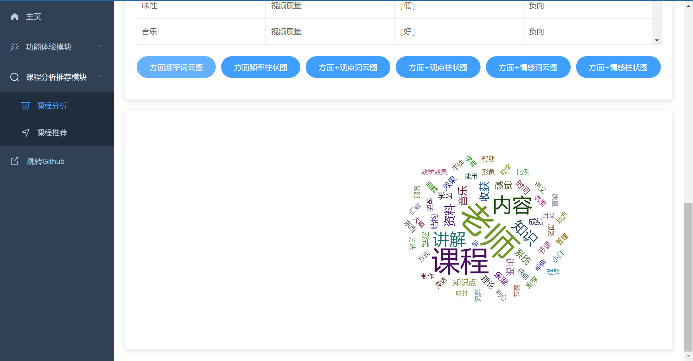
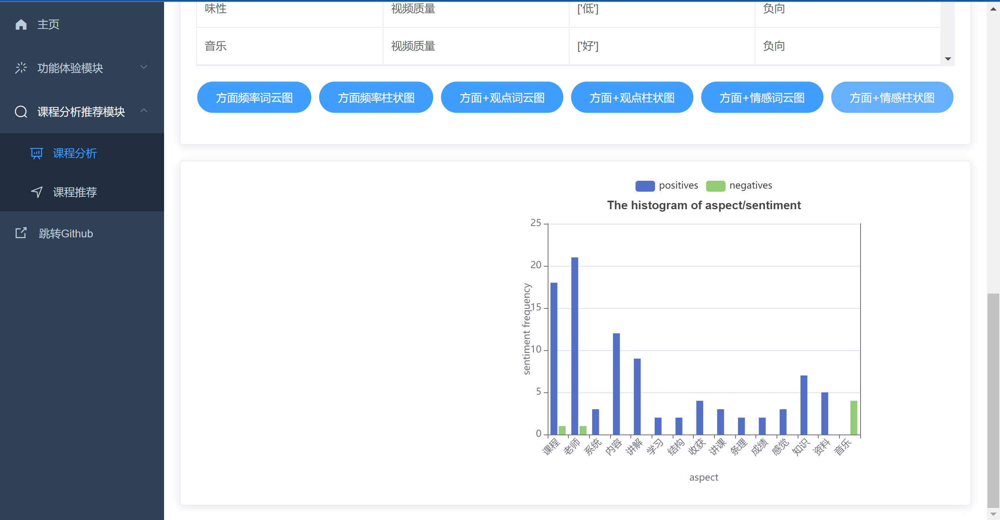

# 项目名称：慕课评论方面级情感分析与推荐系统
# PROJECT: MOOC-ABSA-REC-SYS, MARS


# 一. 项目简介
慕课评论方面级情感分析与推荐系统，前后端分离式架构部署，支持单文本方面级情感分析及上传txt文件进行批量情感分析，并支持分析结果的可视化展示。
技术栈：后端：FastAPI + UIE；前端：Vue + ElementUI + Echarts。

# 二. 项目目录结构   

项目采用前后端分离式架构，分为frontend和backend两个文件夹

* backend文件夹为后端接口服务模块，demo.py为模型预测演示程序，main.py为后端接口服务主程序，utils.py定义一些工具函数。
* frontend文件夹为情感分析与推荐系统前端界面模块，基于 vue-admin-template进行开发。 核心关注src/router/index.js和src/views/两大模块，router中定义了界面路由即侧边栏选项框及映射关系，views文件夹下为搭建的新Web界面，包含欢迎页、单文本情感分析界面和批量文本情感分析界面。

# 三. 项目环境配置
## 3.1 后端服务环境配置

首先需要下载安装Python包管理器Anaconda：https://mirrors.tuna.tsinghua.edu.cn/anaconda/archive/
访问镜像下载网站，根据自己电脑系统（win64或Linux等）选择合适的版本，建议选择较新的版本。

配置清华源镜像加速

```bash
conda config --add channels https://mirrors.tuna.tsinghua.edu.cn/anaconda/pkgs/free/
conda config --add channels https://mirrors.tuna.tsinghua.edu.cn/anaconda/pkgs/main/
conda config --set show_channel_urls yes
```

安装paddlepaddle

```bash
conda install paddlepaddle==2.6.0 --channel https://mirrors.tuna.tsinghua.edu.cn/anaconda/cloud/Paddle/
```

创建新虚拟环境便于隔离，环境名为paddlepaddle，python版本为3.9

```bash
conda create -n paddlepaddle python=3.9
```

进入刚才创建的虚拟环境paddlepaddle，需注意后续环境配置操作都将在该环境中进行配置！！！

```bash
activate paddlepaddle
```

下载paddle，建议安装GPU版本性能更优。简化配置的话也可以选择下载CPU版本
paddle官网下载地址（根据型号等进行选择）：
https://www.paddlepaddle.org.cn/install/quick?docurl=/documentation/docs/zh/install/pip/linux-pip.html
若安装GPU版本需要先配置cuda和cudnn，参考教程：
https://aistudio.baidu.com/aistudio/projectdetail/696822?channelType=0&channel=0
下面给出PaddlePaddle 2.6.0 CPU版本 Windows下pip的下载命令（具体建议以官网提供的为准）：

```bash
python -m pip install paddlepaddle==2.6.0 -i https://pypi.tuna.tsinghua.edu.cn/simple
```

paddle测试是否安装成功，在命令行中依次输入：

```python
python
import paddle
paddle.utils.run_check()
```

若提示 “PaddlePaddle is installed successfully!” 则安装成功！

下载最新版PaddleNLP，若出现不兼容问题可以考虑指定版本降级

```bash
# pip install --upgrade paddlenlp
pip install paddlenlp==2.5.2
```

下载后端依赖Web框架FastAPI

```bash
pip install fastapi
pip install "uvicorn[standard]"
pip install python-multipart
```

下载pandas读取excel文件依赖库
```bash
pip install openpyxl
```

启动后端项目：
通过cd命令进行项目backend文件夹，启动后端接口服务！
```bash
python backend/main.py
```
ps:  初次启动会进行一次模型预测操作进行预热，时间会稍久些但可有效提高后续接口访问的性能。看到“Application startup complete”和“Uvicorn ruuning on http:127.0.0.1:8000”代表后端项目启动成功

接口调试可以下载安装Postman软件便于后端Restful API接口的访问测试。
Postman使用参考：https://mp.weixin.qq.com/s/IoseF-2Ma8mH2gdQLn1rUA

## 3.2  前端项目环境配置：

建议下载个前端IDE便于调试，推荐使用VS Code！由于项目添加了eslint代码标准化审查，建议在VS Code插件市场下载vue和eslint插件。

安装node.js，因项目需要使用到npm管理包！！！
参考：https://m.php.cn/article/483528.html

通过cd命令进行项目frontend文件夹，安装项目所需依赖
```bash
# npm config set registry https://registry.npm.taobao.org # 配置镜像源
npm install
```

启动前端项目
```bash
npm run dev
```
ps:看到App running at:Local: http://localhost:9528代表项目启动成功。此时访问http://localhost:9528即可进入系统

## 3.3 项目使用说明

特别注意要完整访问项目的话，前端和后端项目都要启动哦！！！

### 1.功能演示模块
1.1 单条评论方面级情感分析：在单条评论情感分析界面输入框内输入要进行情感分析的文本，点击情感分析按钮进行情感分析预测。
（例1：老师课讲的很好，生动形象，条理清晰，细节满满! 如果能在之后的讲课中多结合一下现有的技术进行讲课，那就更好了。）
（例2：讲课敷衍，内容肤浅，课件简陋，就是念PPT。）

  

1.2 批量评论方面级情感分析：在批量文本情感分析界面选择要上传的txt文件，点击情感分析按钮进行批量情感分析预测。

  

### 2.课程分析推荐模块
2.1.1 课程评论数据爬取：在课程分析界面选择课程名称，点击数据爬取按钮进行爬取。

  
  数据库视图：
  

2.1.2 课程评论方面级情感分析：在课程分析界面选择课程名称，点击情感分析按钮进行情感分析预测。

  
  数据库视图：
  

2.1.3 课程评论分析结果可视化：一共有六种可视化图形，分别为：“方面频率词云图”、”方面频率柱状图”、”方面+观点词云图”、”方面+观点柱状图”、”方面+情感词云图”和”方面+情感柱状图”

  
  
  
  
  
  

2.2 课程推荐：在课程推荐界面选择课程、关注方面进行推荐（未来会加入难度系数因素），点击推荐按钮即可查看推荐结果。

  
  

# 四. 参考开源代码与组件：

1. 本项目采用的Web系统框架是Vue[1]（前端）+FastAPI[2]（后端），在vue-admin-template[3]模板系统框架的基础上二次开发，列表等展示使用ElementUI[4]组件，图表展示使用Echarts[5]组件。
2. 本项目采用的爬虫组件是Selenium[6]。
3. 本项目采用的深度学习模型是PaddleNLP的unified_sentiment_extraction[7]和multi_class[8]，其中unified_sentiment_extraction用于ACOS的AOS（Aspect-Opinon-Sentiment）分析，即对评论抽取AOS元组；[multi_class]用于ACOS的C（Class）分析，即对A（Aspect）分类。

```
[1]:https://vuejs.org/
[2]:https://fastapi.tiangolo.com/
[3]:https://github.com/PanJiaChen/vue-admin-template
[4]:https://element.eleme.cn/2.11/#/zh-CN
[5]:https://echarts.apache.org/zh/index.html
[6]:https://www.selenium.dev/
[7]:https://github.com/PaddlePaddle/PaddleNLP/tree/develop/applications/sentiment_analysis/unified_sentiment_extraction
[8]:https://github.com/PaddlePaddle/PaddleNLP/tree/develop/applications/text_classification/multi_class
```

# 五. 问题与解决方法：

1. 模型文件checkpoint:
- 问题：运行报错：`ValueError: (InvalidArgument) Deserialize to tensor failed, maybe the loaded file is not a paddle model(expected file format: 0, but 1936876918 found). [Hint: Expected version == 0U, but received version:1936876918 != 0U:0.] (at ..\paddle\fluid\framework\lod_tensor.cc:301) [operator < load_combine > error]`
- 解决方法：出现这个问题应该是因为模型文件checkpoint[https://github.com/Deepennn/MOOC-ABSA-REC-SYS/tree/master/backend/multi_class/checkpoint]git上传时损坏，我已将模型文件压缩包上传至百度网盘[链接：https://pan.baidu.com/s/1klusmEqUbKSuzYhLAclKDA?pwd=MARS 提取码：MARS --来自百度网盘超级会员V4的分享]，解压后在项目中替换即可。
